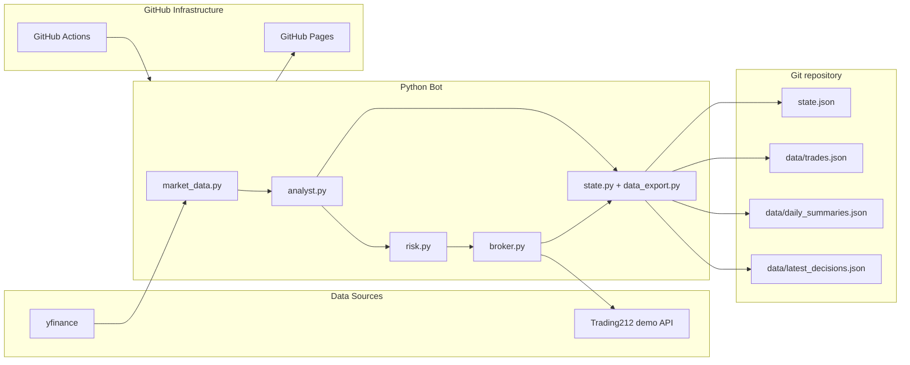

# Trading Bot

An autonomous intraday paper-trading bot built in Python, using GitHub Actions for scheduling, a structured LLM decision engine, and a Trading212 demo API connection. The repository also includes a React + TypeScript dashboard that visualizes bot state, trades, performance, and model decisions.

> Live Dashboard: https://selvanponraj.github.io/T212-Trading-Bot/

## Overview

This project is a portfolio-style trading bot that:

- fetches market data and technical indicators,
- asks an LLM for structured decisions,
- validates the output against risk rules,
- executes approved trades in the Trading212 demo environment,
- persists state and output as JSON files,
- exposes the results through a GitHub Pages dashboard.

It is designed for learning and experimentation. It only targets the Trading212 demo environment and never places real-money trades.

---

## Architecture



---

## Features

- AI-driven trade decisions with structured JSON output and fallback handling
- Multi-layer risk checks for drawdown, loss limits, position sizing, duplicates, and stop-loss/take-profit logic
- Automated execution through GitHub Actions on a self-hosted or GitHub-hosted runner
- Persistent state and historical output stored in JSON files committed to Git
- Portfolio-ready dashboard with pages for overview, positions, trade history, performance, and model insights
- GitHub Pages deployment for the dashboard

---

## Tech Stack

| Layer | Technology |
|---|---|
| Market data | `yfinance`, `ta` |
| AI / model layer | LiteLLM with Gemini fallback |
| Trade execution | Trading212 REST API (demo) |
| Automation | GitHub Actions |
| Dashboard | React + TypeScript + Vite + Tailwind CSS + Recharts |
| Hosting | GitHub Pages |

---

## Repository Layout

```text
.
├── bot/
│   ├── analyst.py
│   ├── broker.py
│   ├── config.py
│   ├── data_export.py
│   ├── main.py
│   ├── market_data.py
│   ├── risk.py
│   └── state.py
├── dashboard/
│   ├── src/
│   ├── public/
│   ├── package.json
│   ├── package-lock.json
│   ├── vite.config.ts
│   └── tsconfig.*
├── data/
│   ├── daily_summaries.json
│   ├── latest_decisions.json
│   └── trades.json
├── design/
│   ├── ARCHITECTURE.md
│   ├── OVERVIEW.md
│   └── phase-*.md
├── .github/
│   └── workflows/
│       ├── claude-code-review.yml
│       ├── deploy-dashboard.yml
│       └── trade.yml
├── .env.example
├── CLAUDE.md
├── README.md
├── requirements.txt
├── state.json
└── .gitignore
```

---

## Quick Start

### 1. Clone the repo

```bash
git clone https://github.com/selvanponraj/T212-Trading-Bot.git
cd T212-Trading-Bot
```

### 2. Create a Python environment

```bash
python3.11 -m venv .venv
source .venv/bin/activate
pip install -r requirements.txt
```

### 3. Configure environment variables

```bash
cp .env.example .env
```

Then populate the required secrets for your local environment:

- `TRADING212_API_KEY`
- `TRADING212_API_SECRET`
- `TRADING212_ENVIRONMENT` (normally `demo`)
- `LITE_LLM_BASE_URL`
- `LITE_LLM_MODEL`
- `LITE_LLM_API_KEY`
- `GEMINI_API_KEY` (optional fallback)

### 4. Run the bot locally

```bash
python -m bot.main
```

This will read `state.json`, run one trade cycle, and write updates back to the repo.

---

## Configuration

Most runtime settings live in `bot/config.py`.

Key settings include:

- watchlist composition
- max open positions
- max position value
- daily loss threshold
- drawdown threshold
- confidence threshold
- default stop-loss/take-profit percentages
- historical indicator window length

---

## Dashboard

The dashboard is implemented under `dashboard/` and is designed to consume the JSON exports from the bot:

- `state.json`
- `data/trades.json`
- `data/daily_summaries.json`
- `data/latest_decisions.json`

### Dashboard pages

- Dashboard overview
- Open positions
- Trade history
- Performance analytics
- Model insights

### Local dev run

```bash
cd dashboard
npm install
npm run dev
```

The app will be available from the Vite dev server, and the production build is used by the GitHub Pages deployment workflow.

---

## Deployment

### GitHub Pages

1. Open the GitHub repository settings.
2. Navigate to `Settings` → `Pages`.
3. Set the source to `GitHub Actions`.
4. Push to `main` with changes under `dashboard/` or `data/` to trigger the deployment workflow.

The workflow file is located at:

- `.github/workflows/deploy-dashboard.yml`

This workflow builds the dashboard and deploys the generated static site to GitHub Pages.

### Bot automation

The scheduled bot workflow is defined in:

- `.github/workflows/trade.yml`

This handles the Python trading run and commits updated state/data back to the repository.

---

## Required GitHub Secrets

Set these in your repository secrets before running the bot or deploying the dashboard:

- `TRADING212_API_KEY`
- `TRADING212_API_SECRET`
- `LITE_LLM_API_KEY`
- `GEMINI_API_KEY`

Optional repository variables:

- `LITE_LLM_BASE_URL`
- `LITE_LLM_MODEL`

---

## Development Notes

This repository is structured to support incremental phases:

- bot logic and scheduling
- data exports and persistence
- dashboard visualization
- deployment automation
- portfolio-style documentation

The current dashboard and deployment workflows are already wired for GitHub Pages and are ready for a first production-style publish.

---

## License

This project is currently unlicensed. Treat it as all rights reserved unless a license is added later.
